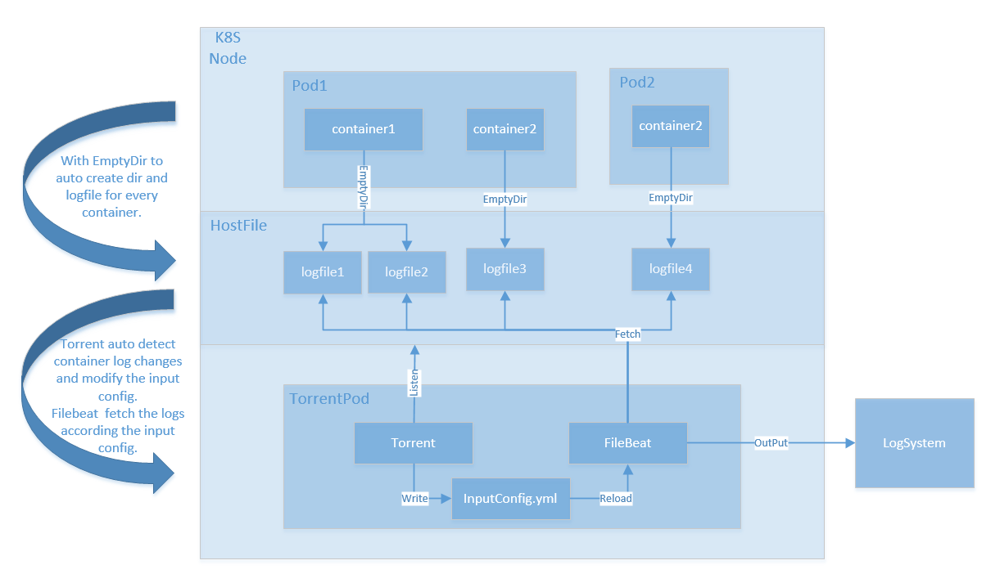

# torrent


# Overview

`torrent` is a kubernetes log tool. 

With `torrent` you can collect logs from kubernetes pods and send them to your centralized log system such as elasticsearch, kafka, logstash and etc.

 `torrent` can collect not only container stdout but also log file that inside kubernetes containers.




# Feature

- Support both stdout and container log files

- Watching and re-reading config files

- You could add tags(module_name) on the logs collected, and later filter by tags in log management.

- Multiple log path support(log_path), support one container have many log dir and wildcard match log name.

  

# Quick Start

```bash
kubectl apply -f https://raw.githubusercontent.com/Rand01ph/Torrent/master/torrent.yaml
```


# Configurations


### Container log files config

使用K8S `annotations` 标记需要收集日志的`Container`

使用 `torrent/module_name` 标记模块名称对应Container name

使用 `torrent/log_path` 标记log信息，使用`;`分隔多个日志路径，使用`:`分隔日志类型及日志目录及日志文件名。

示例:

```yaml
apiVersion: v1
kind: Pod
metadata:
  name: busybox
  namespace: default
  annotations:
    torrent/module_name: busybox
    torrent/log_path: "nginx:/busybox-data:*.log;pro:/var/log:pro.log"
```


### Container stdout config

Kubernetes容器stdout部分日志通过`filebeat`的`autodiscover`方式支持:

配置Pod的`annotations`，增加`torrent/stream: true`及`torrent/module_name: <Container name>`进行标记


### Logstash config for log files

```bash
input {
  kafka {
    bootstrap_servers => "broker:9092"
    topics => ["topics"]
    codec => json
  }
}

filter {
    grok {
        match => {
           source => "/(?<logname>[^/]+)\.log$"
        }
    }
    date {
        match => ["timestamp", "yyyy-MM-dd'T'HH:mm:ss.SSSSSSZZ"]
    }
}

output {
#    stdout { codec => rubydebug }
    file {
        path => "/opt/log_bak/%{+yyyy}/%{+MM}/%{+dd}/%{[fields][module_name]}/%{[fields][log_type]}-%{logname}.log"
        codec => line {
            format => "%{message}"
        }
        flush_interval => 2
    }
}
```


# Rodemap

- [X] README
- [X] push torrent image to DockerHub
- [ ] Update pod for log change
- [ ] Upgrade to torrent-operator for config log collector use CRD -- V3.0
- [ ] change filebeat to one of the log collector backend -- V4.0

# Contribute

Feel free to open issues and pull requests. Any feedback is highly appreciated!
